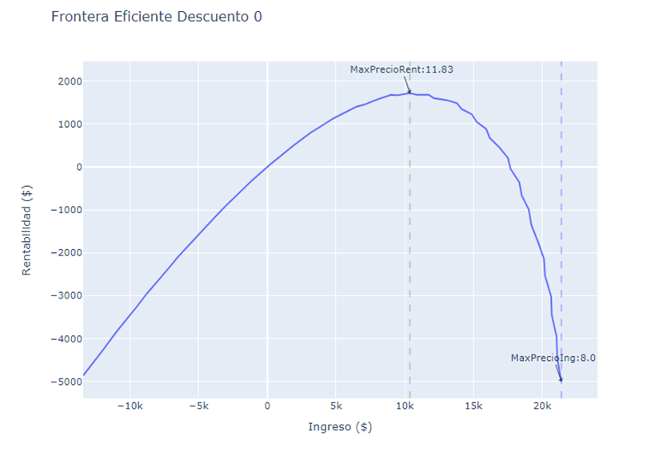

Estimación de función de Precios - Price function estimated using ML

General Objective: Establish a pricing model for "XYZ" for a supermarket chain, focusing on brown eggs products.

Specific Objectives:

Optimize the pricing strategy for the sale of brown eggs in packs of 30 units.
Estimate the demand function using regression techniques to understand the relationship between price and quantity demanded.
Segment by zones using clustering techniques to tailor pricing strategies to different profiles by area.
Implement a price optimization model to maximize revenue and/or profitability for the products under study.

Solution Design: 
i. ETL and Data Cleaning: The extraction and cleaning of data. 
ii. Exploratory Data Analysis: Obtaining the main descriptive statistics, univariate and bivariate tables, and graphs for qualitative and quantitative variables. 
iii. Customer Segmentation: Using clustering algorithms to identify homogeneous groups of regions based on purchasing behaviors, preferences, and price sensitivity. iv. Regression for Demand Function Estimation: Applying linear and logistic regression models to understand the quantitative relationship between the price of eggs and demand, considering variables such as production, seasonality, special events, etc. v. Price Optimization: Developing a price optimization model that takes into account the results of the regression analysis and customer segmentation to determine optimal prices.

Conclusions

A pricing model has been developed for prime brand (XYZ) products and private label products for a product line and a supermarket chain.
Segments have been created based on geographic areas with different price acceptance levels.
The optimal price for the prime product has been determined, with or without a discount, which is 11.83 and 12.90, respectively.

Recommendations

It is recommended to expand the database with a longer time frame to observe the seasonal effect of the product.
The model can also be applied to other products and channels of the company.
